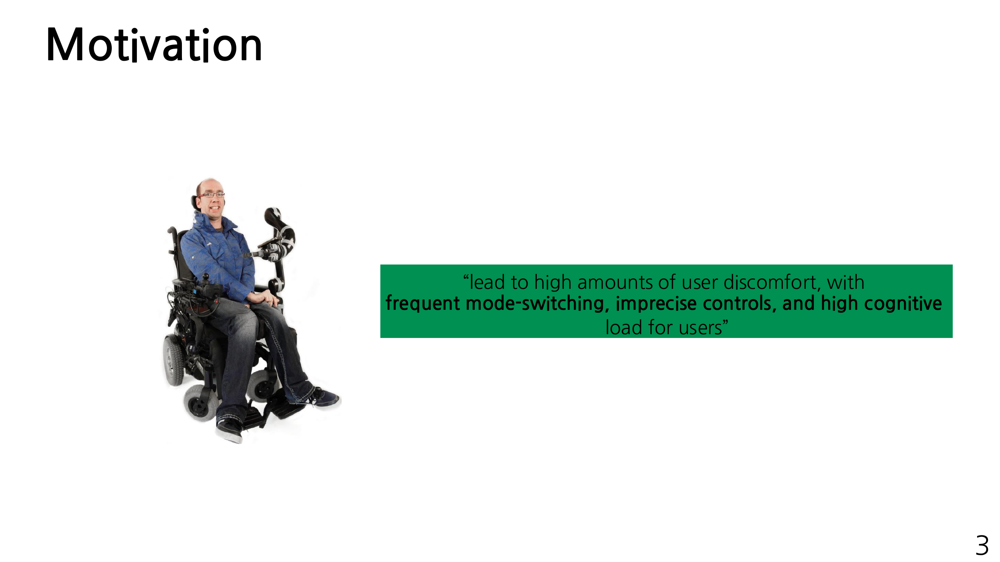
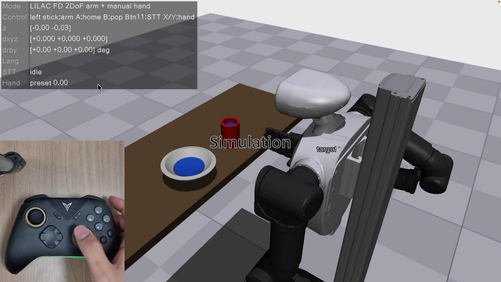
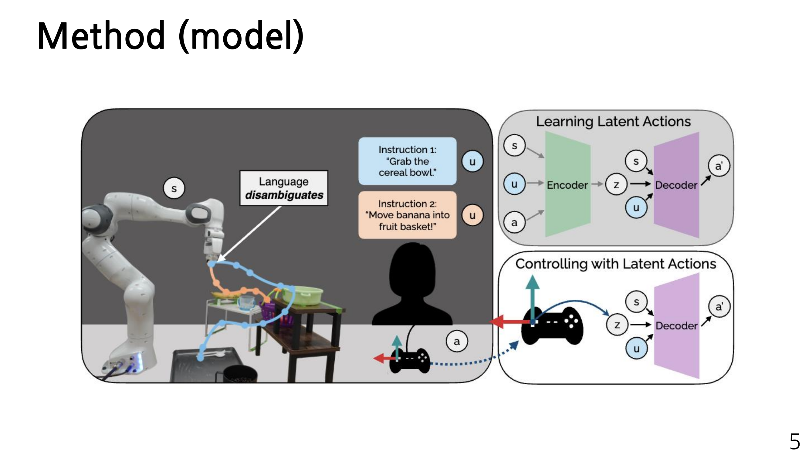
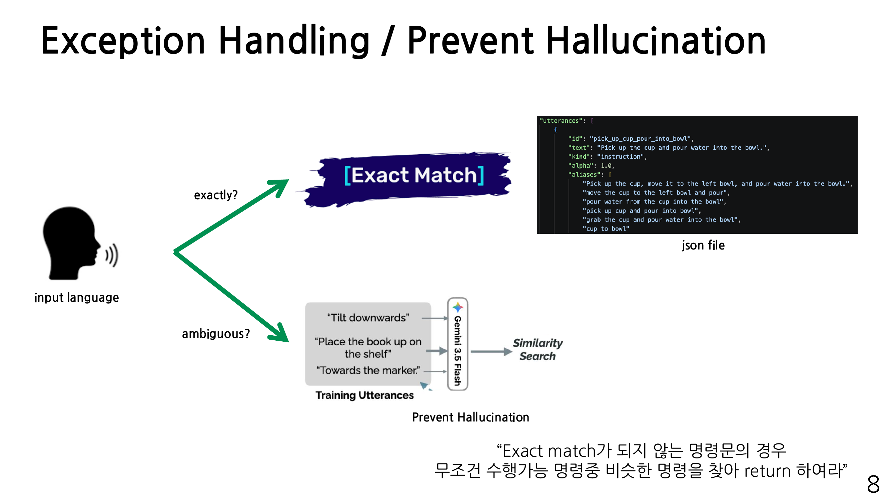
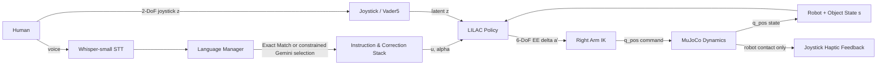
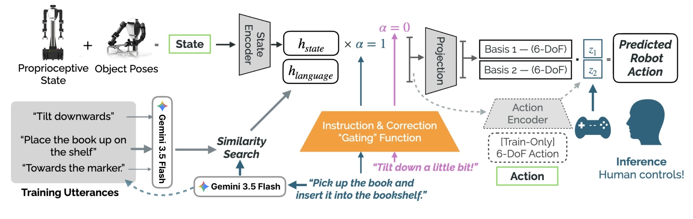
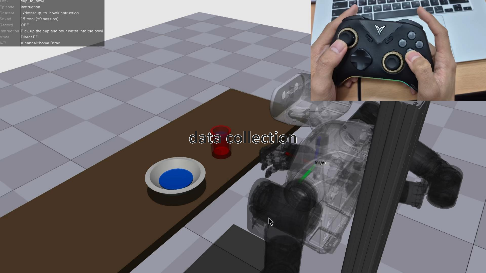
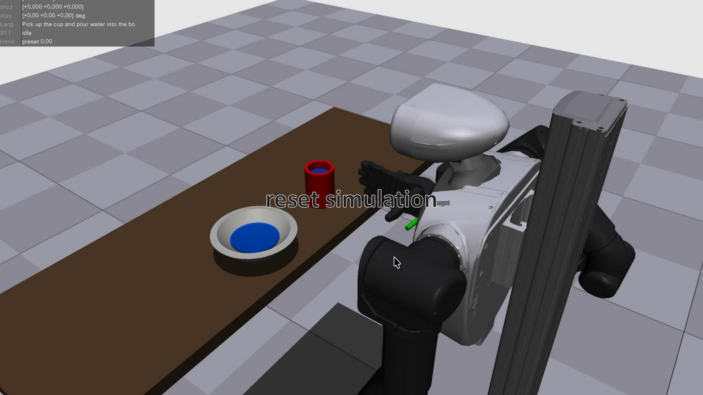
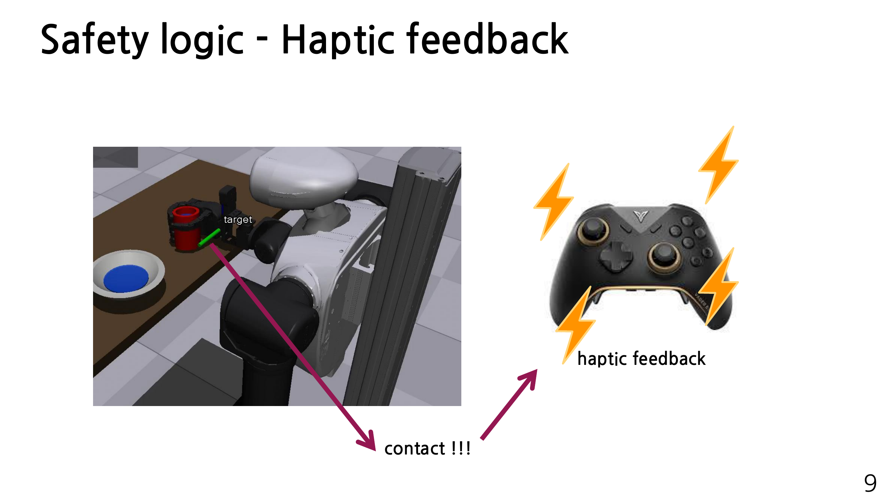

# Adaptive Assistive Robot Control with LILAC

Language-Informed Latent Actions with Corrections를 활용해 **2-DoF joystick input으로 6-DoF robot end-effector를 제어**하는 Human-Robot Interaction(HRI) 프로젝트입니다.

일반적인 joystick teleoperation은 제한된 input DoF로 인해 position과 orientation을 번갈아 조작해야 합니다. 잦은 mode switching은 사용자의 cognitive load를 높이고, 조작 정확도를 떨어뜨리며, 의도하지 않은 robot motion으로 이어질 수 있습니다. 본 프로젝트는 robot state와 language instruction/correction을 이용해 joystick input의 의미를 상황에 맞게 바꾸는 **Shared Autonomy controller**를 구현합니다.

## Table of Contents

- [핵심 아이디어](#core-idea)
- [Language 처리와 Structured Command Selection](#language-processing)
- [System Architecture](#system-architecture)
- [Safety Design](#safety-design)
- [Dataset](#dataset)
- [Troubleshooting](#troubleshooting)
- [Repository Structure](#repository-structure)





<a id="core-idea"></a>

## 핵심 아이디어

사용자는 2-DoF joystick으로 latent action `z`만 입력합니다. LILAC model은 현재 state `s`와 utterance `u`를 함께 해석해, 해당 상황에서 필요한 6-DoF action `a'`를 생성합니다.

```text
(state s, utterance u, latent joystick input z) -> predicted 6-DoF action a'
```

예를 들어 동일한 joystick input이라도 active utterance가 `right`이면 오른쪽 이동을, `pour water`이면 컵을 기울이는 회전 동작을 생성할 수 있습니다. 따라서 사용자는 position/orientation mode를 반복해서 변경하지 않고도 task와 correction에 맞는 동작을 수행할 수 있습니다.



### Model input과 output

| Symbol    | 의미                                  | 현재 구현                                                            |
| --------- | ------------------------------------- | -------------------------------------------------------------------- |
| `s`       | robot와 task의 current state          | right arm joint 7D + end-effector pose 6D + object position 6D = 19D |
| `u`       | instruction 또는 correction utterance | canonical utterance의 768D SBERT embedding                           |
| `alpha`   | instruction/correction gating label   | instruction `1.0`, correction `0.0`                                  |
| `z`       | joystick이 제어하는 latent action     | 2D                                                                   |
| `a`, `a'` | target / predicted robot action       | `[dx, dy, dz, droll, dpitch, dyaw]` 6D                               |

### Conditional Autoencoder 구조

Training 단계에서는 demonstrated action `a`를 `Action Encoder(compressor)`가 2D latent action `z`로 압축하고, `Decoder`가 `(s, u, alpha, z)`로부터 `a'`를 복원합니다. 학습 objective는 `MSE(a', a)`입니다.

Inference 단계에서는 `Action Encoder`를 사용하지 않고, 사람이 joystick으로 직접 제공한 `z`를 `Decoder`에 입력합니다.

```text
Training
  (s, u, alpha, a) -> Action Encoder -> z
  (s, u, alpha, z) -> Decoder        -> a'
  loss = MSE(a', a)

Inference
  human joystick -> z
  (s, u, alpha, z) -> Decoder -> a'
```

`Decoder`는 state와 language를 FiLM으로 결합한 뒤, `Gram-Schmidt`로 orthonormalized된 두 개의 6-DoF basis를 생성합니다. 최종 action은 다음과 같습니다.

```text
B(s, u, alpha) in R^(6x2)
a' = B(s, u, alpha) @ z
```

`alpha=1`인 instruction은 current state context를 적극적으로 사용하고, `alpha=0`인 correction은 state 의존성을 줄여 `right`, `up`, `pour water`와 같은 즉각적인 수정 의도를 우선합니다.

<a id="language-processing"></a>

## Language 처리와 Structured Command Selection

사람은 같은 의도를 서로 다르게 표현합니다. 예를 들어 위쪽 이동을 요청할 때 `"위로 올려"`, `"조금만 위로 이동해"`처럼 표현이 달라질 수 있습니다. Gemini는 이러한 다양한 표현을 해석해 robot이 수행할 수 있는 canonical command로 연결합니다.

본 프로젝트는 [`data/language/lilac_canonical_utterances.json`](data/language/lilac_canonical_utterances.json)에 수행 가능한 command를 정의하고, 다음의 routing을 적용합니다.

1. 입력 문장을 normalize한 뒤 canonical text, id, alias와 **Exact Match**를 먼저 수행합니다.
2. Exact Match 문장은 local result로 즉시 연결합니다.
3. 다양한 표현의 문장은 Gemini가 입력 의도와 가장 유사한 canonical id를 JSON 목록에서 선택합니다.
4. Parser는 선택된 id를 검증하고 structured command로 전달합니다.

Gemini prompt에는 canonical `id`, `text`, `kind`, `aliases` 목록과 raw utterance가 포함됩니다. Gemini는 canonical id 하나를 반환하며, parser는 처리 결과를 structured response로 전달합니다. Controller는 검증된 command를 적용하고 처리 상태에 따라 current target을 안정적으로 유지합니다.



### Instruction과 Correction stack

- `instruction`: 전체 task를 설명하며 새로운 instruction이 들어오면 기존 correction stack을 초기화합니다.
- `correction`: 현재 동작을 즉시 수정하며 LIFO stack에 push됩니다.
- `pop`: 가장 최근 correction을 제거하고 이전 correction 또는 instruction으로 돌아갑니다.

현재 canonical command는 다음과 같습니다.

| Type        | Canonical utterance                                          |
| ----------- | ------------------------------------------------------------ |
| instruction | `Pick up the cup and pour water into the bowl.`              |
| instruction | `pick up remote controller put in box`                       |
| correction  | `right`, `left`, `up`, `down`, `front`, `back`, `pour water` |

선택된 instruction/correction은 LILAC Policy에 전달됩니다. Policy는 current state `s`, utterance `u`, joystick latent `z`를 이용해 6-DoF end-effector action을 생성하고, IK가 이를 right-arm joint command로 변환합니다.

<a id="system-architecture"></a>

## System Architecture



발표 설계에서는 STT/TTS, latent-action controller, robot/simulation을 독립적인 Docker container와 ROS-style service/topic으로 분리했습니다. 현재 repository의 simulation runtime은 `InProcessROSGraph`로 동일한 message flow를 재현합니다.

주요 interface는 다음과 같습니다.

| Interface                             | 역할                                            |
| ------------------------------------- | ----------------------------------------------- |
| `/lilac/apply_utterance`              | Service로 utterance를 canonical command로 변환  |
| `/lilac/active_language`              | 현재 active utterance와 `alpha` publish         |
| `/vader5/latent_z`                    | 2-DoF joystick latent input publish             |
| `/lilac/state`                        | robot joint, end-effector, object state publish |
| `/lilac/ee_delta_6d`                  | LILAC predicted 6-DoF action publish            |
| `/sh5/qpos_cmd`, `/sh5/qpos_state`    | IK command와 MuJoCo dynamics state 전달         |
| `/sim/contact_info`, `/vader5/rumble` | filtered contact와 haptic feedback 전달         |

단발성 language request에는 Service를 사용하고, 지속적으로 갱신되는 state·control·contact data에는 Topic을 사용했습니다.



<a id="safety-design"></a>

## Safety Design

### Safe demonstration만 저장

Data collection 중 잘못된 방향으로 움직이거나 collision 위험이 발생하면 joystick의 **A button**을 눌러 recording을 cancel하고, arm target과 task object를 initial pose로 reset합니다. 이를 통해 실패 trajectory가 dataset에 저장되지 않도록 하고, 안전하게 수행된 demonstration만 학습에 사용했습니다.

Collection 단계에서 **B button**은 recording start/save toggle로 사용됩니다. Inference 단계에서는 A button이 simulation reset, B button이 가장 최근 correction을 `pop`하는 역할을 합니다.





### Robot contact만 Haptic feedback으로 전달

MuJoCo의 built-in contact 정보 전체를 haptic feedback에 연결했을 때, cup과 floor/table 사이의 정상적인 contact까지 감지되어 사용자가 아무 동작을 하지 않아도 joystick vibration이 계속 발생했습니다.

이를 해결하기 위해 contact pair의 body name을 검사하고, `base_link`, `arm_*`, `finger_*` 등 **robot asset이 포함된 contact만 filtering**했습니다. 따라서 cup이 바닥에 닿는 경우에는 진동하지 않고, robot arm이 table 또는 주변 물체와 충돌할 때만 haptic feedback이 발생합니다.



<a id="dataset"></a>

## Dataset

Trajectory는 task별로 `instruction`과 `correction` directory를 분리해 저장합니다.

```text
data/
├── cup_to_bowl/
│   ├── instruction/   # full-task demonstration
│   └── correction/    # directional / pouring correction
├── remote_controller_to_box/
│   └── instruction/
├── language/
│   ├── lilac_canonical_utterances.json
│   └── language_index.npz
└── training/
    └── lilac_sh5_right_arrays.npz
```

각 episode는 두 파일로 구성됩니다.

- `.json`: task, instruction, episode type, frame 수, control frequency 등의 metadata
- `.npz`: joint state, end-effector pose, 6-DoF action, latent `z`, active utterance, correction stack, contact 등의 frame data

### 현재 수집 데이터

| Task / Type                            | Utterance                                                    | Episodes |     Frames |
| -------------------------------------- | ------------------------------------------------------------ | -------: | ---------: |
| `cup_to_bowl/instruction`              | `Pick up the cup and pour water into the bowl.`              |       15 |      6,703 |
| `cup_to_bowl/correction`               | `right`, `left`, `up`, `down`, `front`, `back`, `pour water` |       70 |      4,895 |
| `remote_controller_to_box/instruction` | `pick up remote controller put in box`                       |       12 |      6,429 |
| **Total**                              | 9 canonical utterances                                       |   **97** | **18,027** |

Consecutive frame pair로 action을 구성한 최종 training array에는 **17,930 samples**가 포함되어 있습니다.

<a id="troubleshooting"></a>

## Troubleshooting

### 1. Translation은 충분하지만 pouring rotation이 약한 문제

수집 trajectory에는 `x, y, z` translation movement가 많고, orientation 중에서는 물을 붓기 위한 `roll`이 핵심입니다. 초기 inference에서는 limited 2D latent capacity와 reconstruction objective가 빈도가 높고 변화량이 큰 translation pattern을 우선적으로 표현하면서, task-critical roll output의 effective magnitude가 부족했습니다. 그 결과 cup은 bowl 위치까지 이동하지만 충분히 기울어지지 않아 물을 붓지 못했습니다.

이를 해결하기 위해 inference에서 roll을 포함한 rotation output scale을 기존 대비 약 2배 수준으로 높였습니다. 현재 inference notebook은 `action_pos_scale=0.01`, `action_rot_scale=0.04~0.05`를 사용합니다. 이 tuning은 model이 학습한 action direction은 유지하면서, 실제 rollout에서 rotation channel의 contribution을 보정합니다.

### 2. 모든 MuJoCo contact에서 joystick이 진동하는 문제

전체 contact를 바로 haptic signal로 사용하지 않고, robot body prefix가 포함된 contact만 남기는 filtering logic을 추가했습니다. Object-floor contact는 무시하고 robot collision만 사용자에게 전달합니다.

### 3. Free-form language가 정의되지 않은 command를 만드는 문제

Exact Match를 우선하고, novel utterance만 Gemini로 전달했습니다. Gemini output도 canonical JSON id 중 하나로 제한하고 parser에서 다시 검증해 hallucinated command 실행을 차단했습니다.

### 4. 공용 network에서 ROS message가 섞이는 문제

30명이 동일한 network를 사용하는 수업 환경에서는 ROS 2 environment variable인 `ROS_LOCALHOST_ONLY=1`을 적용했습니다. ROS 2 communication을 각 computer의 localhost로 제한해 다른 팀의 ROS topic이 발견되거나 섞이지 않도록 했습니다.

<a id="repository-structure"></a>

## Repository Structure

```text
.
├── asset/                  # MuJoCo task object mesh와 scene asset
├── data/                   # trajectory, canonical language, training arrays
├── package/
│   ├── lilac_model.py      # Conditional Autoencoder 기반 LILAC model
│   ├── language.py         # Exact Match, Gemini selector, language stack, SBERT
│   ├── controller.py       # latent z -> 6-DoF action runtime controller
│   ├── data.py             # episode recorder와 training array builder
│   ├── training.py         # model training과 latent alignment
│   ├── nodes.py            # ROS-style policy, IK, simulation, haptic, STT nodes
│   ├── runtime.py          # integrated MuJoCo runtime
│   └── sh5_right_arm.py    # SH5 right arm IK와 Vader5 control utility
├── scripts/                # language index, preprocessing, training, runtime CLI
├── sim_notebook/           # collection, training, inference, visualization workflow
└── tests/                  # language routing과 model interface test
```
